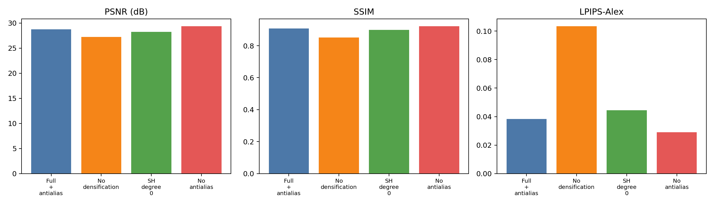
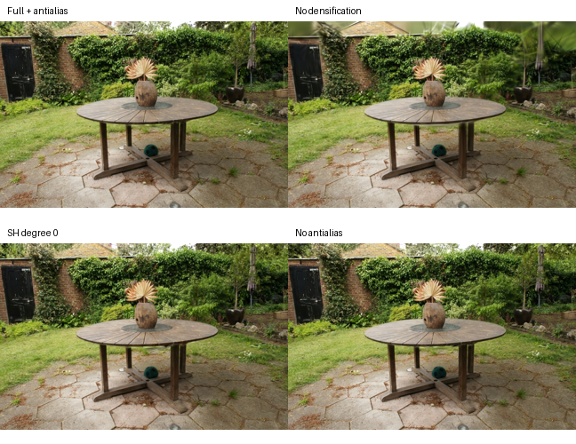

# Official 3DGS Garden Ablation on RTX 4090D

Official graphdeco 3D Gaussian Splatting ablation on the Mip-NeRF 360 `garden` scene.

## Setup

- GPU: NVIDIA RTX 4090D 24GB
- Dataset: official garden `images_8`, 648x420
- Training images: 161
- Test images: 24
- Seed points: 138,766 COLMAP points
- Iterations: 30,000 per run
- CUDA: 11.8
- PyTorch: 2.1.2+cu118
- Official CUDA rasterizer built for `sm_89`
- LPIPS: Alex backbone (`lpips_alex`)

## Ablations

| Variant | Change |
|---|---|
| Full + antialias | SH degree 3, official densification, antialiasing enabled |
| No densification | Disable adaptive densification/pruning |
| SH degree 0 | Remove view-dependent spherical-harmonic color |
| No antialias | Disable antialiased rasterization |

## Results

| Variant | PSNR | SSIM | LPIPS-Alex |
|---|---:|---:|---:|
| Full + antialias | 28.766 | 0.9069 | 0.0383 |
| No densification | 27.219 | 0.8512 | 0.1033 |
| SH degree 0 | 28.262 | 0.8982 | 0.0444 |
| No antialias | 29.350 | 0.9212 | 0.0291 |

## Findings

1. Removing adaptive densification causes the largest drop: PSNR decreases by about 1.55 dB and LPIPS increases substantially.
2. Removing spherical-harmonic view-dependent color causes a modest drop: about 0.50 dB.
3. In this 30k-step run, the classic rasterizer slightly outperforms the antialiased full model on SSIM and LPIPS.
4. All four runs are small-scale single-scene experiments, not multi-scene paper reproductions.

